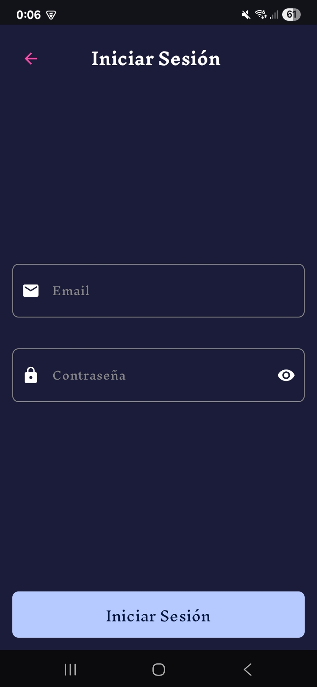
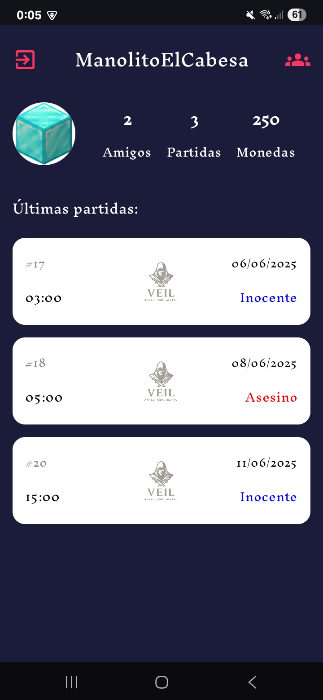

# Veil Companion App

Veil Companion App is an Android application built with Jetpack Compose that serves as a companion to the game "Veil: Tricked". The app allows players to manage their profile, track game history, and connect with friends.

## Features

- **Authentication**: Secure login and registration system
- **Profile Management**: View and edit your player profile
- **Game History**: Track your past games and see your role in each match
- **Friends System**: Connect with other players
    - Send and receive friend requests
    - Accept or reject incoming requests
    - View and manage your friends list
- **Pull-to-refresh**: Easily refresh data by swiping down

## Tech Stack

- **Language**: Kotlin
- **UI Framework**: Jetpack Compose
- **Architecture**: MVVM (Model-View-ViewModel)
- **Dependency Injection**: Dagger Hilt
- **Networking**: Retrofit + OkHttp
- **Image Loading**: Coil
- **Local Storage**: DataStore Preferences
- **Asynchronous Programming**: Kotlin Coroutines and Flow
- **Navigation**: Jetpack Navigation Compose

## Project Structure

```
com.tfg.veilcompanionapp/
├── data/
│   ├── api/               # API service interfaces, models and interceptors
│   ├── local/             # Local storage (DataStore)
│   └── repository/        # Repositories bridging data sources and domain
├── di/                    # Dependency injection modules
├── domain/
│   └── model/             # Domain models
├── ui/
│   ├── components/        # Reusable UI components
│   ├── navigation/        # Navigation routes and graph
│   ├── screens/           # App screens organized by feature
│   │   ├── auth/          # Authentication screens (login, register)
│   │   ├── friends/       # Friends management screens
│   │   ├── home/          # Home screen with game history
│   │   └── splash/        # Application splash screen
│   └── theme/             # App theme, typography, and colors
└── utils/                 # Utility classes
```

## Screenshots






## Authors

- Alvaro F.
- Kida G.
- Ahmed H.
